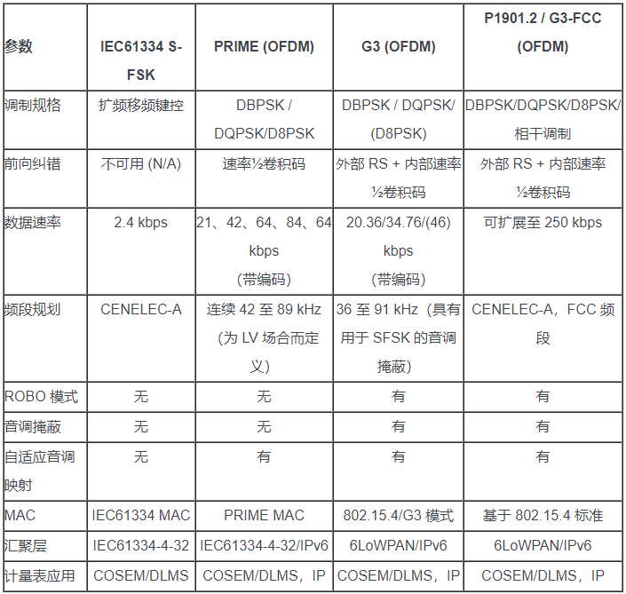

.. |SOCHOME| replace:: **www.soc.xin**

.. _meter:

仪器仪表
===============

|SOCHOME| 收集整理了常用的MCU产品开发资源:

.. contents::
    :local:

SCPI
-----------

可编程仪器标准命令（Standard Commands for Programmable Instruments）定义了一套用于控制可编程测试测量仪器的标准语法和命令。

SCPI于1990与IEEE 488.2协议一起面世。这套标准定义了可用于控制一切仪器的语法，命令结构以及数据格式。比如，通用的命令，如配置仪器参数的命令CONFigure，测量命令MEASure等。这些命令可用于任一仪器，并且同一类的命令属于同一子系统里。SCPI同时也定义了若干仪器的种类。比如，任何可控制的电源都会实现DCPSUPPLY基本功能类型。仪器的类别规定了它们会去实现什么样的子系统，当然也包括针对仪器的特定功能。

HPLC
-----------

**电力线通信** 通过现有的电力线调制通信信号

通信标准
~~~~~~~~~~~

G3
^^^^^^^^^^^

在欧洲，G3 工作于 CENELEC-A 频段 (3～95 kHz)，并可在其他国家扩展到整个 FCC 频段以提供较高的数据速率。

G3 为双向通信标准，具有 20 kbps 至 40 kbps（在 CENELEC-A 频段）和高达 200 kbps 至 400 kbps（在整个 FCC 频段 [G3-FCC]）的有效数据速率。其可与 S-FSK 及其他传统 PLC 技术共存，并无缝支持 DLMS/COSEM（IEC 62065 系列），而且提供了用于 CCM 的第 2 层 128 位 AES 以增加数据安全性。目前，针对 IPv6 的支持使得 G3 能够以一种高效的方式汇聚 IPv4 和 IPv6 设备与网络。

G3 采用正交频分复用 (OFDM) 调制，可提供针对干扰和衰减的高度适应性。因此，它能够在中压变压器之间穿越时实现最远距离达 6 英里的可靠通信。另外，该标准还可在横跨低压和中压 (LV/MV) 变换时实现总距离不超过 2～3英里（具体数值取决于通道条件）的通信。

G3 穿过变压器的能力是一项很重要的性能，对于低人口密度的乡村地区尤其如此。特别是在北美地区，住户与公用事业设备之间的低压变换可能只延伸 3～4 米。在该变压器之前布设一个集中器完全无法实现必要的密度，因此增加这个集中器是得不偿失的。

G3 专为解决该问题而设计，其允许 PLC 信号穿过低压变压器并分配至中压线路。这使得能够将集中器放置在其可从多得多的位置聚集数据的地方，从而改善实现家庭/商企与公用事业公司之连接的成本效益性。

另外，G3 还构成了 ITU G.9955（G.9956 用于 G3 MAC）标准的附录 A 和附录 D (G3-FCC) 部分。目前，IEEE 正在制定 G3 的全球性版本（名称定为 P1901.2）。最终的标准预计将于 2012 年底之前制定完成。其他与 OFDM 相关的标准包括 G.9955/9955 主体（即 G.hnem）。

为了支持数据速率的增加和覆盖范围的扩大，G3-FCC 采用了相干调制选项。实际上，当通道能够通过使用导频信号进行可靠估测时，就可使性能相比于差分调制有所改善。G3-FCC 支持面向 Robo 模式、BPSK、QPSK、8PSK 和 16-QAM 的相干解调，并可提供高达 5 dB 的增益。与相干调制有关的已知难题包括晶振漂移以及如何在一个 AC 周期之内控制通道变更。

PLC-Lite
^^^^^^^^^^^

PLC-Lite 适合于对成本非常敏感的环境，以及那些不需要 G3 和 PRIME 的复杂性、但仍然需要一条稳健通信通道的应用。
