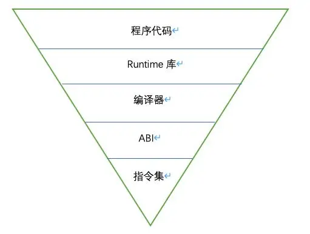

.. _device:

硬件基础
===============

.. toctree::
    :maxdepth: 1

    ARM <arm>

.. contents::
    :local:
    :depth: 1

函数调用
-----------

函数调用是通过栈来实现的，在栈中存放着该函数的局部变量。函数在调用的时候都是在栈空间上开辟一段空间以供函数使用。

​栈帧结构就是在程序运行中发生函数调用时，会产生一个调用栈，调用栈里面存储四类数据，分别为：函数参数、程序返回地址、基地址寄存器EBP的值以及局部变量。

* ESP：栈指针寄存器(extended stack pointer)，放着一个指针，该指针永远指向系统栈最上面一个栈帧（栈帧不理解没关系）的栈顶。
* EBP：基址指针寄存器(extended base pointer)，放着一个指针，该指针永远指向系统栈最上面一个栈帧的底部。
* EIP：指令寄存器(extended instruction pointer)，存储CPU下一个要执行的指令的地址。

中断处理
-----------

:ref:`arm` 处理器中断处理过程与8051单片机中断处理过程基本一样，区别在于arm处理器可能好几个中断共用一个中断向量地址，所以需要在中断程序中判断是哪个中断源，同时软件清除中断标志位。

代码密度
-----------

对于内存受限的嵌入式芯片（包括MCU和成本要求的AP类芯片）来说代码密度非常重要。同样功能的程序，如果代码密度过大，就可能导致因ROM空间装载不下而无法使用。在嵌入式领域中，代码密度是最重要的指标之一。
代码密度主要由指令集、ABI、编译器、Runtime库、程序代码五个部分决定。处在金字塔的越底端，说明该因素的越底层，更新的频率越小，但辐射和影响的范围却越广。

.. contents::
    :local:
    :depth: 1

指令集
~~~~~~~~~~~~~~

指令集是代码密度最根本的决定性因素，它决定了一个操作在最优的情况下需要编译成多少位宽的编码。
很多体系结构比如ARM、RISC-V、C-SKY都是16位指令、32位指令混编的，同样的一条指令，如果能够被编译成16位指令，那么它显然比编译成32位指令占用更小的空间；再比如，一个乘累加的操作，如果指令集中存在乘累加指令，那么它只需要一条指令来实现乘累加操作，如果没有则需要至少两条指令来完成相同的操作，假设指令都是32位的，显然一条指令将占用更少的空间。
由于指令集的编码空间是有限的，所以指令集设计的核心是将哪些指令（包括指令操作数的范围）放到编码空间当中，就像一个商场的店面是有限的，当我们把需求最广的商家引进来时，商场的销量就会达到最高。

ABI
~~~~~~~~~~~~~~

ABI（Application Binary Interface）是二进制级别的协议，它指导着编译器如何生成代码和二进制程序，同样也指导着用户如何写汇编代码。它主要包含函数调用约定（calling convention）、数据的对齐方式等内容。
其中对代码密度影响最大的就是函数调用约定，它规定了堆栈寄存器、链接寄存器、哪些寄存器寄存器需要在函数头尾保存和恢复、哪些寄存器可以作为参数寄存器等，还有一些特殊用途的寄存器。大部分特殊寄存器都是会被高频使用的，配合指令集设计可以降低代码密度；需要保存和恢复的寄存器个数同样也会影响代码密度。

编译器
~~~~~~~~~~~~~~

编译器是开发者最直接接触的工具，也是给开发者体感最强的代码密度影响因素。它对代码密度的影响主要体现在两方面：

* 编译器本身的优化能力，优化能力的强弱是影响编译器产品竞争力的最主要的因素。
* 编译器的使用方法，比如GCC，除了添加-Os之外，还可以添加-ffunction-sections -fdata-sections -Wl,--gc-sections来删除没有用到的函数。

Runtime
~~~~~~~~~~~~~~

Runtime库是指程序运行所需的一些基本的函数库，它们一般都是预先编译好，和编译器一起打包发布，是工具链的一部分。

由于这些函数的使用频率较高，一般程序都会用到一部分Runtime库的函数，对这些函数做针对性地优化会有比较好的收益。

程序代码
~~~~~~~~~~~~~~

开发者写的代码质量也会影响程序的代码密度，虽然编译器能够优化一部分冗余代码，但是并不能保证百分之百的优化，所以开发者也要注意代码的质量。
