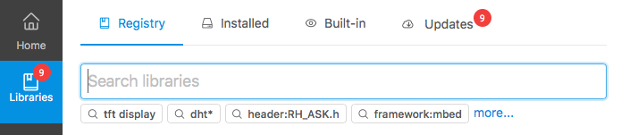

.. |PIOHOME| replace:: **PlatformIO Home**

.. _piohome:

PlatformIO Home
===============

|PIOHOME| allows you to interact with PlatformIO's professional collaborative platform
using modern and cross-platform GUI:

.. contents:: Contents
    :local:

Quick Start
-----------

PlatformIO Core
~~~~~~~~~~~~~~~

Please launch |PIOHOME| Web-server using :ref:`start` command and open in
your browser http://127.0.0.1:8008.

You can change host and port. Please check :ref:`start` command for details.

Demo
----

Welcome & Project Manager
~~~~~~~~~~~~~~~~~~~~~~~~~

Project Inspect
~~~~~~~~~~~~~~~

Statistics
''''''''''

Only code analysis (:ref:`start`)

