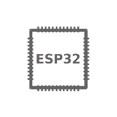

Knowledge Domain
===========================

**嵌入式开发知识体系管理**

.. only:: latex

==================  ==================  ==================
|基础知识|_          |编程能力|_         |开发工具|_
------------------  ------------------  ------------------
`基础知识`_          `编程能力`_         `开发工具`_
------------------  ------------------  ------------------
|系统环境|_          |应用领域|_         |实践总结|_
------------------  ------------------  ------------------
`系统环境`_          `应用领域`_         `实践总结`_
==================  ==================  ==================

.. |基础知识| image:: _static/get-started.png
.. _基础知识: rtos/index.html

.. |编程能力| image:: _static/api-reference.png
.. _编程能力: rtos/index.html

.. _开发工具: rtos/index.html

.. |系统环境| image:: _static/api-guides.png
.. _系统环境: rtos/index.html

.. |应用领域| image:: _static/contribute.png
.. _应用领域: rtos/index.html

.. _实践总结: rtos/index.html

.. toctree::
    :caption: 基础知识
    :maxdepth: 1

    模拟外设 <interface/analog>
    数字外设 <interface/digital>
    低速通信 <interface/normal>
    高速通信 <interface/bus>
    调试接口 <interface/debug>

.. toctree::
    :caption: 编程能力
    :maxdepth: 1

    C系语言 <lang/C>
    汇编语言 <lang/asm>
    脚本语言 <lang/script>

.. toctree::
    :caption: 开发工具
    :maxdepth: 1

    IDE <tools/ide>
    GCC <tools/gcc>
    KiCad  <tools/kicad>

.. toctree::
    :caption: 系统环境
    :maxdepth: 1

    边缘系统 <rtos/index>
    中心系统 <os/index>

.. toctree::
    :caption: 应用领域
    :maxdepth: 1

    物联网 <app/iot>
    机器人 <app/robot>
    信号处理 <app/signal>
    仪器仪表 <app/meter>

.. toctree::
    :caption: 实践总结
    :maxdepth: 1

    PID控制 <summary/pid>
    GUI设计 <summary/gui>
    平台对接 <summary/cloud>

