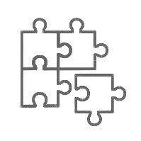

Knowledge
===========================

.. image:: _static/images/all.png
    :target: https://www.qitas.cn

==================  ==================  ==================  ==================
|编程能力|_          |开发工具|_         |产品架构|_          |实践总结|_
------------------  ------------------  ------------------  ------------------
`编程能力`_          `开发工具`_         `产品架构`_          `实践总结`_
==================  ==================  ==================  ==================

.. |编程能力| image:: _static/images/api.png
.. _编程能力: lang/index.html

.. _开发工具: tools/index.html

.. |产品架构| image:: _static/images/product.png
.. _产品架构: product/index.html

.. |实践总结| image:: _static/images/resources.png
.. _实践总结: summary/index.html

.. toctree::
    :caption: 章节目录
    :maxdepth: 2

    编程能力 <lang/index>
    开发工具 <tools/index>
    产品架构 <product/index>
    经验总结 <summary/index>

关于芯片相关的知识框架全部迁移到了 `芯文档 <https://docs.SoC.xin>`_ 关于开源和软件架构相关知识归到 `OS-Q <https://docs.OS-Q.com>`_

在本文中，目前更多是一些个人感悟和各种杂散不好归类的知识，还没有很好形成体系
