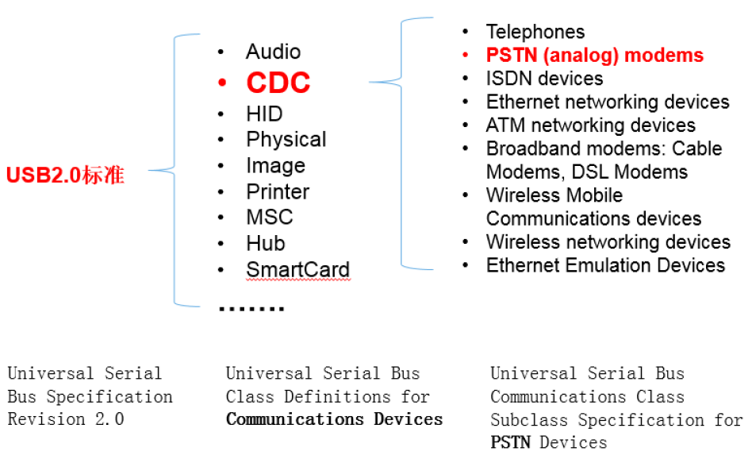

.. _cdc:

CDC
===============

.. contents::
    :local:

定义
-----------

CDC(Communication Device Class)类是USB2.0标准下的一个子类，定义了通信相关设备的抽象集合。CDC类是USB组织定义的一类专门给各种通信设备（电信通信设备和中速网络通信设备）。

根据CDC类所针对通信设 备的不同，CDC类又被分成以下不同的模型：USB传统纯电话业务（POTS）模型，USB ISDN模型和USB网络模型。

其中，USB传统纯电话业务模型，有可分为直接线控制模型（Direct Line Control Model）、抽象控制模型（Abstract Control Model）和USB电话模型（USB Telephone Model）。

通常一个CDC类又由两个接口子类组成通信接口类（Communication Interface Class）和数据接口类(Data Interface Class)。

通过通信接口类对设备进行管理和控制，而通过数据接口类传送数据。这两个接口子类占有不同数量和类型的终端点 （Endpoints）。

对于前面所述的不同CDC类模型，其所对应的接口的终端点需求也是不同的。如所需要讨论的抽象控制模型对终端点的需 求，通信接口类需要一个控制终端点（Control Endpoint）和一个可选的中断（Interrupt）型终端点，数据接口子类需要一个方向为输入（IN）的周期性（Isochronous）型终端 点和一个方向为输出（OUT）的周期性型终端点。其中控制终端点主要用于USB设备的枚举和虚拟串口的波特率和数据类型（数据位数、停止位和起始位）设置 的通信。输出方向的非同步终端点用于主机（Host）向从设备（Slave）发送数据，相当于传统物理串口中的TXD线（如果从单片机的角度看），输入方 向的非同步终端点用于从设备向主机发送数据，相当于传统物理串口中的RXD线。

