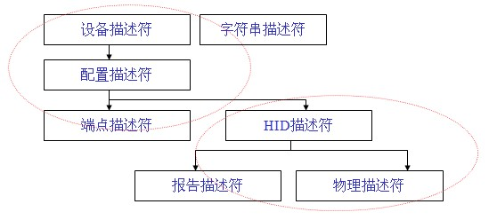

.. _hid:

HID
===============

归属于 :ref:`usb`

.. contents::
    :local:

定义
-----------

除了USB标准定义的一些描述符外，HID设备还必须定义HID描述符。另外设备和主机的通信是通过报告的形式来实现的，所以还必须定义报告描述符；而物理描述符不是必需的。还有就是HID描述符是关联于接口（而不是端点）的，所以设备不需要为每个端点都提供一个HID描述符。

.. list-table::
    :header-rows:  1

    * - 偏移量
      - 域
      - 长度
      - 类型
      - 描述
    * - 0
      - bLength
      - 1
      - 数字
      - 描述符的长度
    * - 1
      - bDescriptorType
      - 1
      - 常量
      - 描述符种类(0x21)

