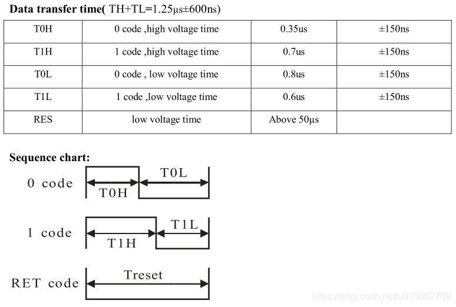
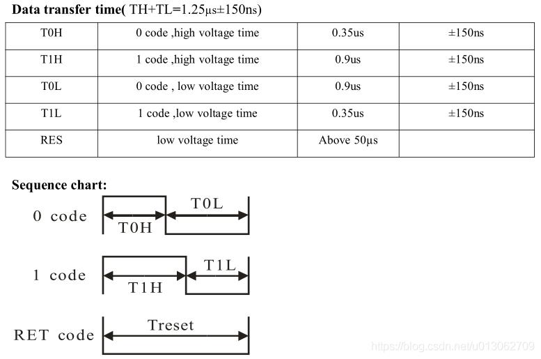
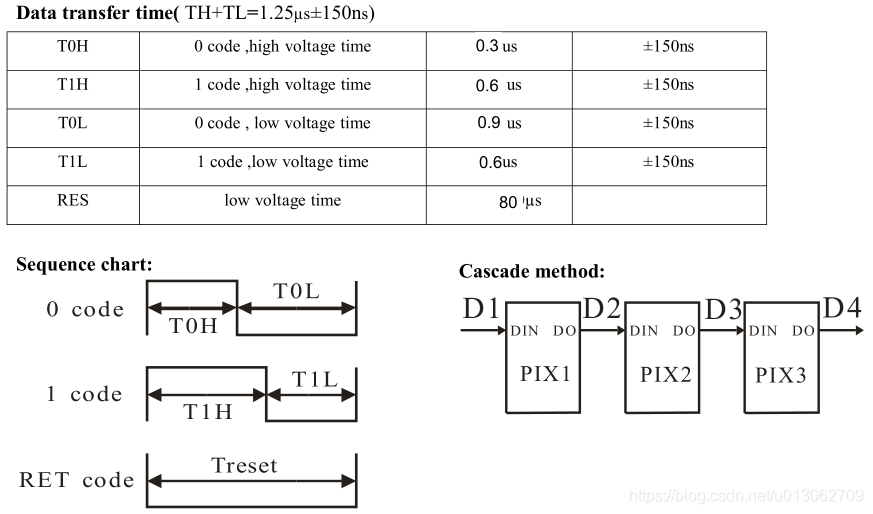
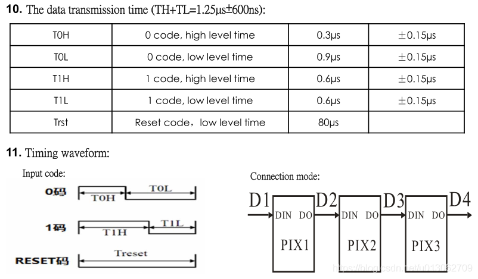
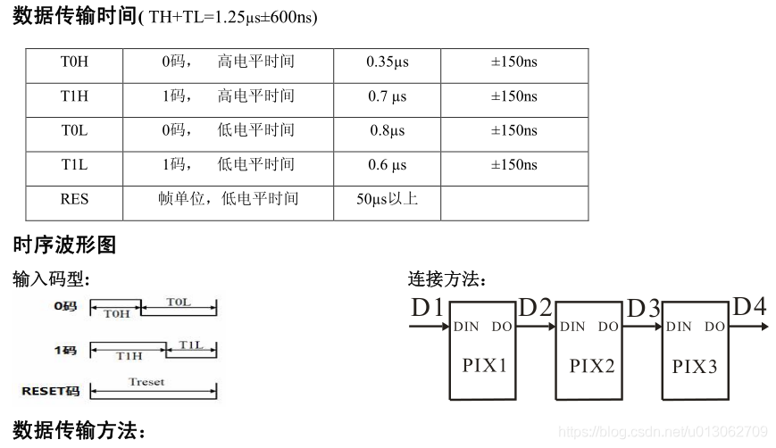
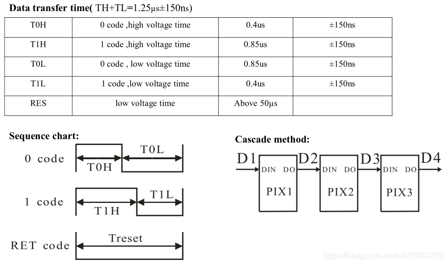
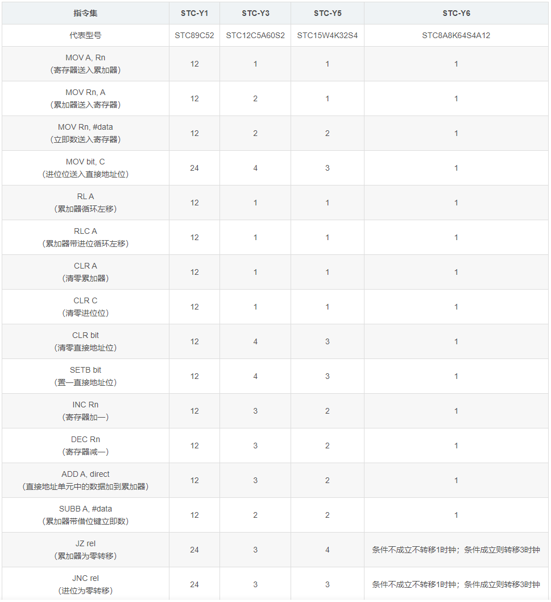

.. _lan_asm:

汇编优化
===============

.. contents::
    :local:

WS2812
-----------

这款RGB LED采用单总线通信方式，可以多级串联。但对时序的要求比较高，低速单片机开发难度大。

STM32驱动方式：

* 直接控制IO口，并精确调整延时；
* 将SPI的时钟调整为8MHz，发送一字节正好是1.25us，给ws2812发送0即通过SPI总线发送11000000b，发送1即通过SPI总线发送11111100b；
* 第三种方式使用PWM，周期设置为3MHz，发送0就把占空比设置为33%，发送1就把占空比设置为66%；

STC驱动
-----------

假设STC主频为12MHz，1.25us即0.00000125/(1/12M)=15个周期，也就是说我们要在15个周期内执行一定数量的指令来完成IO置高、IO置低、数据移位、跳转等所有必要的操作

示例代码
~~~~~~~~~~~

1. 汇编实现

.. code-block:: bash

    void ws2812asm(unsigned char dat)
    {
    #pragma asm
        MOV A, R7
        MOV R6, #0x08
    WS2812LOOP:
        SETB P3.7
        RLC A
        MOV P3.7, C
        NOP
        CLR P3.7
        DJNZ R6, WS2812LOOP
    #pragma endasm
    }

R7即函数调用时传入的dat，将dat放入累加器A中，然后将8放入R6中作为循环计数，这里我用的是P3.7引脚，用SETB语句将它置为高电平，然后用RLC指令将dat左移一位，最高位进入进位位C，使用MOV语句将进位位的值赋给P3.7引脚，NOP延时，之后将P3.7引脚置为低电平，DJNZ将计数值减一不为零则跳转到WS2812LOOP继续执行。整个代码的循环体耗时为3+1+3+1+3+4=15个CLK

循环体外有两个MOV语句，函数调用前会有一个MOV语句将参数传入寄存器R7，之后LCALL语句调用函数，调用完之后还有RET语句返回，这样一来整个函数调用的总时间为3+4+1+2+14+4=28个CLK

小于45us的高电平为判定为逻辑0，大于45us的高电平被判定为逻辑1，低电平的时长只要不要超过复位信号的时长都可以完成数据的传输！

2. C实现

.. code-block:: bash

    void ws2812_write_byte(u8 dat)
    {
        u8 i = 8;
        dat <<= 1;
        while(i)
        {
            WS2812_IO = 1;
            WS2812_IO = CY;
            WS2812_IO = 0;
            dat <<= 1;
            i--;
        }
    }

.. note::

    CY进位标志位（在进行算术运算时，可以被硬件置位或清零，以表示运算结果中高位是否有进位或借位的状态。

