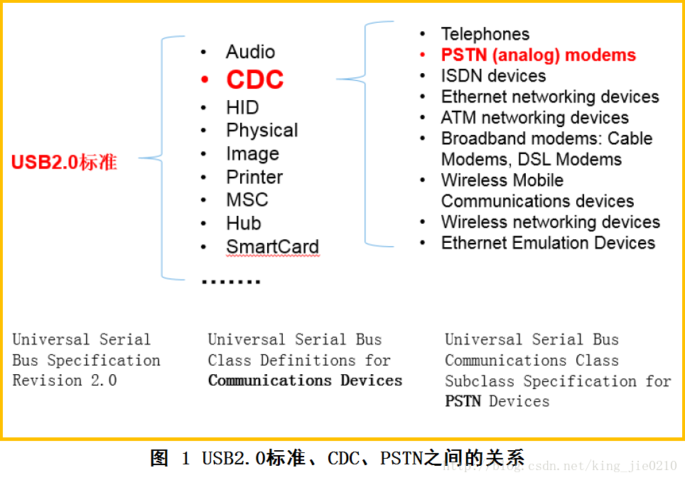

.. _usb:

USB
===============

.. contents::
    :local:

tinyUSB
-----------

用于嵌入式系统的开源跨平台 USB 主机/设备堆栈，旨在实现无动态分配的内存安全和延迟所有中断事件的线程安全，然后在非ISR任务功能中进行处理。

.. image:: ./images/tinyUSB.png
    :target: https://www.oschina.net/p/tinyusb

堆栈协议
~~~~~~~~~~~~

从机堆栈
^^^^^^^^^^^^

通过动态更改 USB 描述符支持多种设备配置。低功耗功能，例如挂起、恢复和远程唤醒。支持以下设备：

* 蓝牙主机控制器接口（BTH HCI）
* CDC
* 设备固件更新（DFU）：仅 Runtinme
* 人机界面设备（HID）：通用输入和输出设备，键盘、鼠标和游戏手柄等...
* 大容量存储类（MSC）：具有多个LUN
* MIDI
* 带有 RNDIS，CDC-ECM 的网络
* USB 测试和测量类别（USBTMC）
* 具有供应商特定类的WebUSB

主机堆栈
^^^^^^^^^^^^

主机堆栈正在重构，并且未经测试。

* 人机界面设备（HID）：键盘，鼠标，通用
* 大容量存储类（MSC）
* 集线器目前仅支持1级集线器

Zadig
-----------

Zadig是一个安装通用USB驱动程序的Windows应用程序，诸如WinUSB,libusb-win32/libusb0.sys,libusbK,可以帮助你快速的使用USB设备。

对于以下情况可能特别有用：

* 您想要使用libusb-based的应用程序访问设备
* 你想升级一个通用的USB驱动程序
* 你想使用WinUSB访问设备

源代码

.. code-block:: bash

    $ git clone git://github.com/pbatard/libwdi

USB CDC
-----------

CDC(Communication Device Class)类是USB2.0标准下的一个子类，定义了通信相关设备的抽象集合。

CDC类是USB组织定义的一类专门给各种通信设备（电信通信设备和中速网络通信设备）使用的USB子类。根据CDC类所针对通信设 备的不同，CDC类又被分成以下不同的模型：USB传统纯电话业务（POTS）模型，USB ISDN模型和USB网络模型。其中，USB传统纯电话业务模型，有可分为直接线控制模型（Direct Line Control Model）、抽象控制模型（Abstract Control Model）和USB电话模型（USB Telephone Model），如图1所示。本文所讨论的虚拟串口就属于USB传统纯电话业务模型下的抽象控制模型。

通常一个CDC类又由两个接口子类组成通信接口类（Communication Interface Class）和数据接口类(Data Interface Class)。

通过通信接口类对设备进行管理和控制，而通过数据接口类传送数据。这两个接口子类占有不同数量和类型的终端点 （Endpoints）。

对于前面所述的不同CDC类模型，其所对应的接口的终端点需求也是不同的。如所需要讨论的抽象控制模型对终端点的需 求，通信接口类需要一个控制终端点（Control Endpoint）和一个可选的中断（Interrupt）型终端点，数据接口子类需要一个方向为输入（IN）的周期性（Isochronous）型终端 点和一个方向为输出（OUT）的周期性型终端点。其中控制终端点主要用于USB设备的枚举和虚拟串口的波特率和数据类型（数据位数、停止位和起始位）设置 的通信。输出方向的非同步终端点用于主机（Host）向从设备（Slave）发送数据，相当于传统物理串口中的TXD线（如果从单片机的角度看），输入方 向的非同步终端点用于从设备向主机发送数据，相当于传统物理串口中的RXD线。

