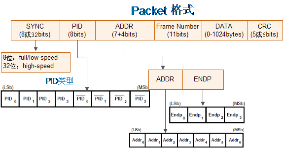
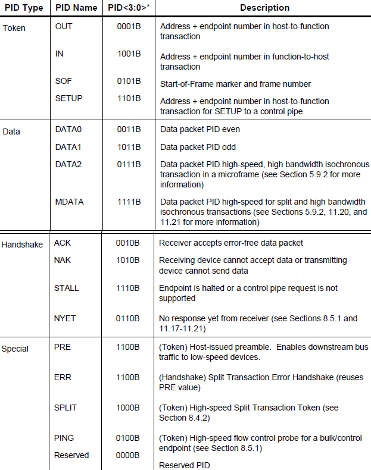
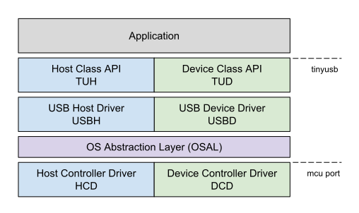

.. _usb:

USB
===============

.. contents::
    :local:

概念
-----------

.. contents::
    :local:

子类
~~~~~~~~~~~

一个【传输】(控制、批量、中断、等时)：由多个【事务】组成；
一个【事务】(IN、OUT、SETUP)：由一多个【Packet】组成。

Packet
^^^^^^^^^^^^

包（Packet）是USB系统中信息传输的基本单元，所有数据都是经过打包后在总线上传输的。
数据在 USB总线上的传输以包为单位，包只能在帧内传输。高速USB 总线的帧周期为125us，全速以及低速 USB 总线的帧周期为 1ms。
帧的起始由一个特定的包（SOF 包）表示，帧尾为 EOF。EOF不是一个包，而是一种电平状态，EOF期间不允许有数据传输。

包是USB总线上数据传输的最小单位，不能被打断或干扰，否则会引发错误。
若干个数据包组成一次事务传输，一次事务传输也不能打断，属于一次事务传输的几个包必须连续，不能跨帧完成。一次传输由一次到多次事务传输构成，可以跨帧完成。

USB包由五部分组成，即同步字段（SYNC）、包标识符字段（PID）、数据字段、循环冗余校验字段（CRC）和包结尾字段（EOP），包的基本格式如下图：

接口
~~~~~~~~~~~

USB使用一根屏蔽的4线电缆与网络上的设备进行互联。数据传输通过一个差分双绞线进行，这两根线分别标为D+和D-，另外两根线是Vcc和Ground，其中Vcc向USB设备供电。

使用USB电源的设备称为总线供电设备，而使用自己外部电源的设备叫做自供电设备。

子类
~~~~~~~~~~~
.. toctree::
    :maxdepth: 1

    CDC  <cdc>

下层
-----------

.. contents::
    :local:

tinyUSB
~~~~~~~~~~~~

用于嵌入式系统的开源跨平台 USB 主机/设备堆栈，旨在实现无动态分配的内存安全和延迟所有中断事件的线程安全，然后在非ISR任务功能中进行处理。

从机堆栈
^^^^^^^^^^^^

通过动态更改 USB 描述符支持多种设备配置。低功耗功能，例如挂起、恢复和远程唤醒。支持以下设备：

* 蓝牙主机控制器接口（BTH HCI）
* CDC
* 设备固件更新（DFU）：仅 Runtinme
* 人机界面设备（HID）：通用输入和输出设备，键盘、鼠标和游戏手柄等...
* 大容量存储类（MSC）：具有多个LUN
* MIDI
* 带有 RNDIS，CDC-ECM 的网络
* USB 测试和测量类别（USBTMC）
* 具有供应商特定类的WebUSB

主机堆栈
^^^^^^^^^^^^

主机堆栈正在重构，并且未经测试。

* 人机界面设备（HID）：键盘，鼠标，通用
* 大容量存储类（MSC）
* 集线器目前仅支持1级集线器

上层
-----------

.. contents::
    :local:

Zadig
~~~~~~~~~~~

Zadig是一个安装通用USB驱动程序的Windows应用程序，诸如WinUSB,libusb-win32/libusb0.sys,libusbK,可以帮助你快速的使用USB设备。

对于以下情况可能特别有用：

* 您想要使用libusb-based的应用程序访问设备
* 你想升级一个通用的USB驱动程序
* 你想使用WinUSB访问设备

源代码

.. code-block:: bash

    $ git clone git://github.com/pbatard/libwdi

Bus Hound
~~~~~~~~~~~

