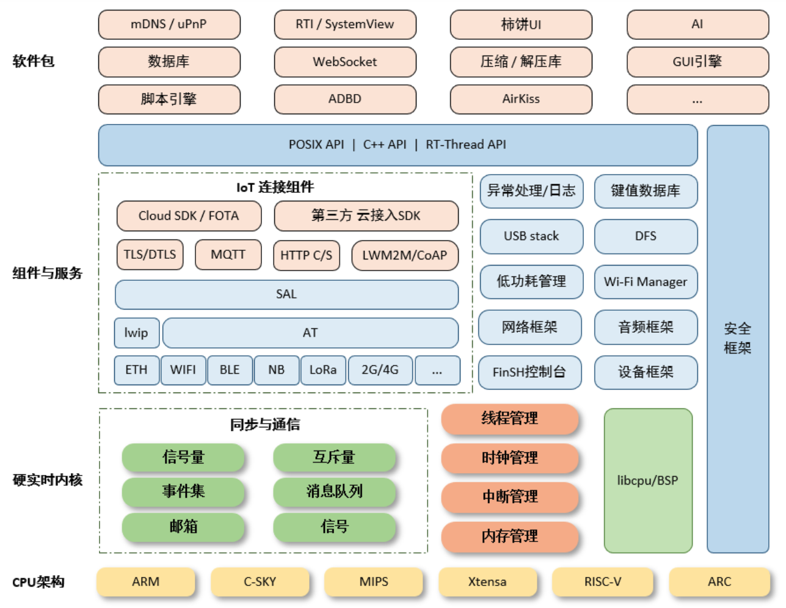

.. _rtt:

RT-Thread
===============

.. contents::
    :local:

简介
-----------

RT-Thread是一个集实时操作系统（RTOS）内核、中间件组件和开发者社区于一体的技术平台，具有极小内核、稳定可靠、简单易用、高度可伸缩、组件丰富等特点。RT-Thread拥有一个国内最大的嵌入式开源社区，同时被广泛应用于能源、车载、医疗、消费电子等多个行业，累积装机量达数千万台，成为国人自主开发、国内最成熟稳定和装机量最大的开源RTOS。

RT-Thread拥有良好的软件生态，支持市面上所有主流的编译工具如GCC、Keil、IAR等，工具链完善、友好，支持各类标准接口，如POSIX、CMSIS、C++应用环境、Javascript执行环境等，方便开发者移植各类应用程序。商用支持所有主流MCU架构，如ARM Cortex-M/R/A, MIPS, X86, Xtensa, C-Sky, RISC-V，几乎支持市场上所有主流的MCU和Wi-Fi芯片。

RT-Thread有完整版和Nano版，对于资源受限的微控制器（MCU）系统，可通过简单易用的工具，裁剪出仅需要 3KB Flash、1.2KB RAM 内存资源的 NANO 内核版本；而相对资源丰富的物联网设备，可使用RT-Thread完整版，通过在线的软件包管理工具，配合系统配置工具实现直观快速的模块化裁剪，并且可以无缝地导入丰富的软件功能包，实现类似 Android 的图形界面及触摸滑动效果、智能语音交互效果等复杂功能。

特点
-----------

* 资源占用极低，超低功耗设计，最小内核（Nano版本）仅需1.2KB RAM，3KB Flash。
* 组件丰富，繁荣发展的软件包生态 。
* 简单易用 ，优雅的代码风格，易于阅读、掌握。
* 高度可伸缩，优质的可伸缩的软件架构，松耦合，模块化，易于裁剪和扩展。
* 强大，支持高性能应用。
* 跨平台、芯片支持广泛。
