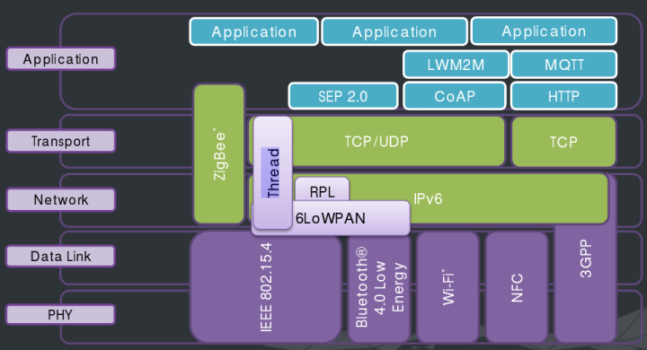

.. _zephyr:

Zephyr
===============

.. contents::
    :local:

简介
-----------

Zephyr 是 Linux 基金会于 2016 年 2 月推出的一个适用于物联网的小型可伸缩的实时操作系统，支持多种处理器架构。

Zephyr 可在 RAM 大小为 8KB 的 MCU 上流畅运行，经过裁剪甚至可在 RAM 为最小的 2KB 时运行。

Zephyr 是安全的、开源的、模块化的以及支持多种连接方式，将支持 Bluetooth, Bluetooth LE, WiFi, 802.15.4 以及 6Lowpan, CoAP, IPv4, IPv6, and NFC.。

Zephyr是一个面向物联网的嵌入式实时操作系统（RTOS）具有以下特点：

* 1.安全的，灵活、高可扩展性，支持多种硬件平台（ARM、ARC、X86、xtensa、nois2、riscv32）；
* 2.基于Apache 2.0许可，完全开源，代码托管在github；
* 3.主要用C语言编写，代码风格、框架与Linux十分相似；
* 4.支持多种开发环境（Windows、Linux、MacOS）；

Zephyr 相比其他开源物联网系统具有以下优点：

* 开源：使用 Apache 2.0 开源许可；
* 模块化：针对受限制的物联网设备而设计，可以通过 Kconfig 裁剪功能选项，从而实现用户自定义的最佳配置；
* 联网能力：系统中提供了多种针对低功耗、内存受限设备的连接协议，支持低功耗蓝牙(BLE)、wifi、802.15.4以及其他标准，包括6lowpan、coap、ipv4和ipv6 ；
* 安全性：项目在开发过程中将安全因素考虑在内，该项目中提供了安全验证、模糊和渗透测试、代码审查、静态代码分析、威胁建模和审查等多种检测方法，用来防止代码中存在后门和漏洞。以上工作由专门的安全小组及维护人员进行监督和维护。

与其它微型内核相比，Zephyr 内核有很多独特的优秀特性：

* 1.单地址空间操作系统。将应用程序相关的代码与内核结合在一起，创建一个在硬件上加载、运行的单一镜像。应用程序代码和内核代码运行在同一个共享地址空间。
* 2.高度可配置。允许应用程序只包含它们需要的功能。
* 3.编译时定义资源。所有系统资源都在编译时定义，以减小代码量、增强代码性能。
* 4.最小错误检查。提供最小化的运行时错误检查，以减小代码量、增强代码性能。提供一个可选的错误检查基础，以协助应用程序的开发和调试。

提供了许多耳熟能详的服务：

*  多线程服务：为基于优先级的、非抢占式的 fiber 和基于优先级的、抢占式的 task 提供可选的时间片。
*  中断服务：在编译时、运行时均可注册中断处理函数。
*  线程间同步服务：包括二元信号量、计数信号量和互斥信号量。
*  线程间数据传递服务：包括基本消息队列、增强型消息队列和字节流。
*  内存分配服务：动态地分配固定尺寸、可变尺寸的内存块。
*  电源管理服务：包括无滴答 CPU 空转和高级 CPU 空转。
