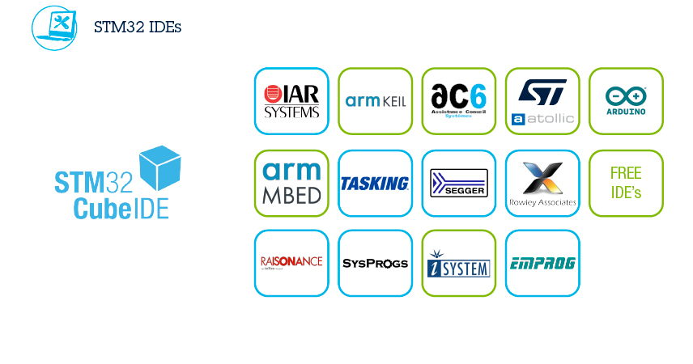

.. _cubeide:

STM32CubeIDE
==============

.. contents::
    :local:

简介
------------

STM32CubeIDE是ST官方提供的免费软件开发工具，也是STM32Cube生态系统的一员大将。它基于Eclipse®/CDT框架，GCC编译工具链和GDB调试工具，支持添加第三方功能插件。同时，STM32CubeIDE还集成了部分STM32CubeMX和STM32CubeProgrammer的功能，是一个 “多合一”的STM32开发工具。

参数说明
~~~~~~~~~~~~

