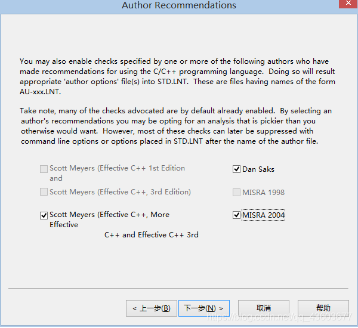

.. _lint:

LINT
===========

.. contents::
    :local:

PC-Lint
-------------

随着项目的推进与迭代，一个Project的代码量往往会不知不觉增长，当项目代码达到数万行，迭代经历较长时间后，仅靠开发人员自身的代码质量已不能满足对整体质量的把控。

难以避免会出现一些潜在的逻辑错误与非逻辑错误。这种情况下，定期code review是不错的选择，但是在开发人员数量较少，开发模式趋于敏捷开发的今天，快速迭代，开发人员技术参差不齐，即便选择code review也不能发现大多数潜在风险。如果自己进行全盘代码的review，其难度不亚于将项目重构，此时引入工具就变得迫在眉睫。

PC-Lint是C/C++软件代码静态分析工具，你可以把它看作是一种更加严格的编译器。它不仅可以检查出一般的语法错误，还可以检查出那些虽然符合语法要求但不易发现的潜在错误。

PCLint识别并报告C语言中的编程陷阱和格式缺陷的发生。它进行程序的全局分析，能识别没有被适当检验的数组下标，报告未被初始化的变量，警告使用空指针，冗余的代码，等等。软件除错是软件项目开发成本和延误的主要因素。PClint能够帮你在程序动态测试之前发现编码错误。这样消除错误的成本更低。
使用PC-Lint在代码走读和单元测试之前进行检查，可以提前发现程序隐藏错误，提高代码质量，节省测试时间。并提供编码规则检查，规范软件人员的编码行为。

PC-Lint版本：PC-lint for C/C++ (NT) Vers. 9.00L (https://files.cnblogs.com/files/godan/Gimpel_PC_Lint_9.rar) 免费可用版本

下载好PC-Lint后，需要再去官网下载最新的patch包。 https://gimpel.com/

安装配置
~~~~~~~~~~~

PC-Lint是C/C++软件代码静态分析工具，你可以把它看作是一种更加严格的编译器。它不仅可以检查出一般的语法错误，还可以检查出那些虽然符合语法要求但不易发现的潜在错误。
C语言的灵活性带来了代码效率的提升，但相应带来了代码编写的随意性，另外C编译器不进行强制类型检查，也带来了代码编写的隐患。PCLint识别并报告C语言中的编程陷阱和格式缺陷的发生。它进行程序的全局分析，能识别没有被适当检验的数组下标，报告未被初始化的变量，警告使用空指针，冗余的代码，等等。软件除错是软件项目开发成本和延误的主要因素。PClint能够帮你在程序动态测试之前发现编码错误。这样消除错误的成本更低。
使用PC-Lint在代码走读和单元测试之前进行检查，可以提前发现程序隐藏错误，提高代码质量，节省测试时间。并提供编码规则检查，规范软件人员的编码行为。
由于PC-LINT对于一般程序员来说可能比较陌生，有好多人安装了也不知道怎样配置和使用。

代码分析
~~~~~~~~~~~

641: (Warning -- Converting enum 'XXX' to int)
^^^^^^^^^^^^^^^^^^^^^^^^^^^^^^^^^^^^^^^^^^^^^^^

不能直接把enum转成int;
